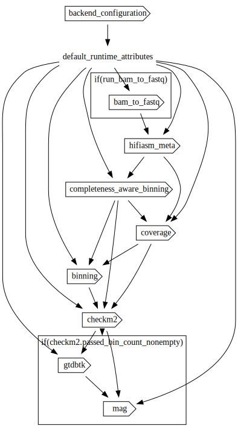

# wdl-metagenomics
Workflow for identifying high-quality MAGs (Metagenome-Assembled Genomes) from PacBio HiFi metagenomic assemblies written in [Workflow Description Language (WDL)](https://openwdl.org/).

- For the snakemake version of these workflows, see [here](https://github.com/PacificBiosciences/pb-metagenomics-tools).
- Docker images used by these workflows are defined [here](https://github.com/PacificBiosciences/wdl-dockerfiles).
- Common tasks that may be reused within or between workflows are defined [here](https://github.com/PacificBiosciences/wdl-common).

# Workflow

**Workflow entrypoint**: [workflows/main.wdl](workflows/main.wdl)

The metagenomics workflow combines contig assembly and PacBio's [HiFi-MAG-Pipeline](https://github.com/PacificBiosciences/pb-metagenomics-tools/tree/master/HiFi-MAG-Pipeline). This includes a completeness-aware binning step to identify complete contigs (>500kb and >93% complete) and incomplete contigs (<500kb and/or <93% complete). Completeness is assessed using [CheckM2](https://github.com/chklovski/CheckM2)). Coverage is calculated for binning steps. The long contigs that are <93% complete are pooled with incomplete contigs and this set goes through binning with [MetaBAT2](https://bitbucket.org/berkeleylab/metabat) and [SemiBin2](https://github.com/BigDataBiology/SemiBin). The two bin sets are compared and merged using [DAS Tool](https://github.com/cmks/DAS_Tool). The complete contigs and merged bin set are pooled together to assess bin quality. All bins/MAGs that passed filtering undergo taxonomic assignment and data summaries are produced.



## Setup

Some tasks and workflows are pulled in from other repositories. Ensure you have initialized submodules following cloning by running `git submodule update --init --recursive`.

# TODO - confirm
## Resource requirements

The workflow requires at minimum _cores_ cores, 45-150 GB of RAM, and >250GB temporary disk space. Ensure that the backend environment you're using has enough quota to run the workflow.

## Reference datasets and associated workflow files

Reference datasets are hosted publicly for use in the pipeline. For data locations, see the [backend-specific documentation](backends/) and template inputs files for each backend with paths to publicly hosted reference files filled out.

# Running the workflow

1. [Select a backend environment](#selecting-a-backend)
2. [Configure a workflow execution engine in the chosen environment](#configuring-a-workflow-engine)
3. [Optional] [Register the engine in Workbench](#registering-a-workflow-engine-in-workbench)
4. [Fill out the inputs JSON file for your cohort](#filling-out-the-inputs-json)
5. [Run the workflow](#running-the-workflow-1)

## Selecting a backend

The workflow can be run on Azure, AWS, GCP, or HPC. Your choice of backend will largely be determined by the location of your data.

For backend-specific configuration, see the relevant documentation:

- [Azure](backends/azure)
- [AWS](backends/aws)
- [GCP](backends/gcp)
- [HPC](backends/hpc)

## Configuring a workflow engine

An execution engine is required to run workflows. Two popular engines for running WDL-based workflows are [`miniwdl`](https://miniwdl.readthedocs.io/en/latest/getting_started.html) and [`Cromwell`](https://cromwell.readthedocs.io/en/stable/tutorials/FiveMinuteIntro/).

See [Workbench's documentation](https://docs.dnastack.com/docs/introduction-to-engines-and-backends) as well as the [backend-specific documentation](backends) for details on setting up an engine.

| Engine | Azure | AWS | GCP | HPC |
| :- | :- | :- | :- | :- |
| [**miniwdl**](https://github.com/chanzuckerberg/miniwdl#scaling-up) | _Unsupported_ | Supported via the [Amazon Genomics CLI](https://aws.amazon.com/genomics-cli/) | _Unsupported_ | (SLURM only) Supported via the [`miniwdl-slurm`](https://github.com/miniwdl-ext/miniwdl-slurm) plugin |
| [**Cromwell**](https://cromwell.readthedocs.io/en/stable/backends/Backends/) | Supported via [Cromwell on Azure](https://github.com/microsoft/CromwellOnAzure) | Supported via the [Amazon Genomics CLI](https://aws.amazon.com/genomics-cli/) | Supported via Google's [Pipelines API](https://cromwell.readthedocs.io/en/stable/backends/Google/) | Supported - [Configuration varies depending on HPC infrastructure](https://cromwell.readthedocs.io/en/stable/tutorials/HPCIntro/) |

## Registering a workflow engine in Workbench

Once an engine has been configured, it can optionally be registered in [Workbench](https://workbench.dnastack.com/) to enable a unified interface for workflow submission, monitoring, and statistics. Once configured, workflow runs may be submitted either [via the browser](https://docs.dnastack.com/docs/accessing-the-workbench-gui) or [via the Workbench CLI](#run-using-workbench).

See [Workbench's documentation](https://docs.dnastack.com/docs/connecting-to-a-workflow-engine) for details on how to register an engine in Workbench. Backend-specific resources and default configurations that may be required as part of engine setup may also be found in the [backends](backends) directory.

Workbench requires a license to use. For information on obtaining a license or to set up a demo, please contact [support@dnastack.com](mailto:support@dnastack.com).

## Filling out the inputs JSON

The input to a workflow run is defined in JSON format. Template input files with reference dataset information filled out are available for each backend:

- [Azure](backends/azure/inputs.azure.json)
- [AWS](backends/aws/inputs.aws.json)
- [GCP](backends/gcp/inputs.gcp.json)
- [HPC](backends/hpc/inputs.hpc.json)

Using the appropriate inputs template file, fill in the cohort and sample information (see [Workflow Inputs](#workflow-inputs) for more information on the input structure).

If using an HPC backend, you will need to download the reference bundle and replace the `<local_path_prefix>` in the input template file with the local path to the reference datasets on your HPC.

## Running the workflow

Run the workflow using the engine and backend that you have configured ([miniwdl](#run-directly-using-miniwdl), [Cromwell](#run-directly-using-cromwell), [Workbench](#run-using-workbench)).

Note that the calls to `miniwdl` and `Cromwell` assume you are accessing the engine directly on the machine on which it has been deployed. Depending on the backend you have configured, you may be able to submit workflows using different methods (e.g. using trigger files in Azure, or using the Amazon Genomics CLI in AWS). Calls to the Workbench CLI will be the same regardless of the engine/backend combination.

### Run directly using miniwdl

`miniwdl run workflows/main.wdl -i <input_file_path.json>`

### Run directly using Cromwell

`java -jar <cromwell_jar_path> run workflows/main.wdl -i <input_file_path.json>`

### Run using Workbench

Rather than running a workflow directly using an engine, engines can be configured using [Workbench](https://workbench.dnastack.com/). Workbench presents a unified interface to the respective backends and engines. Workflow runs may be submitted and monitored either [directly in-browser](https://docs.dnastack.com/docs/accessing-the-workbench-gui) or using the command-line interface (CLI) (see below).

Note that these steps assume you have already [set up and registered an engine in Workbench](https://docs.dnastack.com/docs/workbench-settings).

1. [Install and configure the DNAstack CLI](#installing-and-configuring-the-dnastack-cli)
2. [Register the workflow on Workbench](#registering-the-workflow-on-workbench)
3. [Submit a workflow run](#submitting-workflow-runs-via-workbench)

Steps (1) and (2) are one-time setup, following which any number of workflow runs may be submitted.

For assistance and licensing, please contact [support@dnastack.com](mailto:support@dnastack.com).

#### Installing and configuring the DNAstack CLI

1. Install the DNAstack CLI

`python3 -m pip install --user dnastack-client-library`

Confirm that the CLI is installed and available by running `dnastack --version`.

2. Authenticate using the CLI

`dnastack auth login`

3. Configure the CLI to use workbench

`dnastack use workbench.dnastack.com`

You can now use the DNAstack CLI to interact with Workbench.

#### Registering the workflow on Workbench

From the root of this repository, run:

```bash
dnastack alpha workbench workflows create \
	--name "${WORKFLOW_NAME}" \
	--description =@README.md \
	workflows/main.wdl
```
Note the `internalId` field of the returned JSON. This will be used as the `--url` value when submitting workflow runs.

This step only needs to be completed once, when initially registering the workflow. Following this initial setup, additional runs may be submitted by using the same `internalId` recorded here.

#### Submitting workflow runs via Workbench

In the following command, replace `<input_file_path.json>` with the path to your filled out inputs file, and `<internalId>` with the ID you noted in step (1). If no engine is provided, the default engine you have configured will be used.

```bash
dnastack workbench runs submit \
	--workflow-params @<input_file_path.json> \
	--url <internalId> \
	[--tags <key=value>] \
	[--engine <engineId>]
```

# Workflow inputs

This section describes the inputs required for a run of the workflow.

# TODO - confirm
The workflow can start with either a FASTQ or BAM file.

# General inputs

| Type | Name | Description | Notes |
| :- | :- | :- | :- |
| String | sample_id | Sample ID; used for naming files. | |
| File | hifi_reads_bam | HiFi reads in BAM format. If supplied, the reads will first be converted to a FASTQ. One of [hifi_reads_bam, hifi_reads_fastq] is required. | |
| File | hifi_reads_fastq | HiFi reads in FASTQ format. One of [hifi_reads_bam, hifi_reads_fastq] is required. | |
| File | checkm2_ref_db | The CheckM2 DIAMOND reference database Uniref100/KO used to predict the completeness and contamination of MAGs. | |
| Int | min_contig_length | Minimum size of a contig to consider a long contig. [500000] | |
| Int | min_contig_completeness | Minimum completeness percentage (from CheckM2) to mark a contig as complete and place it in a distinct bin; this value should not be lower than 90%. [93] | |
| Int | metabat2_min_contig_size | The minimum size of contig to be included in binning for MetaBAT2. [30000] | |
| String | semibin2_model | The trained model to be used in SemiBin2. If set to 'TRAIN', a new model will be trained from your data. ('TRAIN', 'human_gut', 'human_oral', 'dog_gut', 'cat_gut', 'mouse_gut', 'pig_gut', 'chicken_caecum', 'ocean', 'soil', 'built_environment', 'wastewater',  'global') ['global'] | |
| String | dastool_search_engine | The engine for single copy gene searching used in DAS Tool. ('blast', 'diamond', 'usearch') ['diamond'] | |
| Float | dastool_score_threshold | Score threshold until selection algorithm will keep selecting bins (0..1); used by DAS Tool. [0.2] | |
| Int | min_mag_completeness | Minimum completeness percent for a genome bin. [70] | |
| Int | max_mag_contamination | Maximum contamination threshold for a genome bin. [10] | |
| Int | max_contigs | The maximum number of contigs allowed in a genome bin. [20] | |
| File | gtdbtk_data_tar_gz | A .tar.gz file of GTDB-Tk (Genome Database Taxonomy toolkit) reference data, release207_v2 used for assigning taxonomic classifications to bacterial and archaeal genomes. | |

## Other inputs

| Type | Name | Description | Notes |
| :- | :- | :- | :- |
| String | backend | Backend where the workflow will be executed | \["Azure", "AWS", "GCP", "HPC"\] |
| String? | zones | Zones where compute will take place; required if backend is set to 'AWS' or 'GCP'. | <ul><li>[Determining available zones in AWS](backends/aws/README.md#determining-available-zones)</li><li>[Determining available zones in GCP](backends/gcp/README.md#determining-available-zones)</li></ul> |
| String? | aws_spot_queue_arn | Queue ARN for the spot batch queue; required if backend is set to 'AWS' and `preemptible` is set to `true` | [Determining the AWS queue ARN](backends/aws/README.md#determining-the-aws-batch-queue-arn) |
| String? | aws_on_demand_queue_arn | Queue ARN for the on demand batch queue; required if backend is set to 'AWS' and `preemptible` is set to `false` | [Determining the AWS queue ARN](backends/aws/README.md#determining-the-aws-batch-queue-arn) |
| String? | container_registry | Container registry where workflow images are hosted. If left blank, [PacBio's public Quay.io registry](https://quay.io/organization/pacbio) will be used. | |
| Boolean | preemptible | If set to `true`, run tasks preemptibly where possible. On-demand VMs will be used only for tasks that run for >24 hours if the backend is set to GCP. If set to `false`, on-demand VMs will be used for every task. Ignored if backend is set to HPC. | \[true, false\] |

# Workflow outputs

## General outputs

| Type | Name | Description | Notes |
| :- | :- | :- | :- |
| File? | converted_fastq | | |
| File | primary_contig_graph | | |
| File | primary_contig_fasta | | |
| File | hifi_reads_fasta | | |

## Completeness-aware binning

| Type | Name | Description | Notes |
| :- | :- | :- | :- |
| File | bins_contigs_key_txt | | |
| File | incomplete_contigs | | |
| Array[File] | long_bin_fastas | | |
| File? | contig_quality_report_tsv | | |
| File? | passed_bins_txt | | |
| File? | scatterplot_pdf | | |
| File? | histogram_pdf | | |

## Coverage

| Type | Name | Description | Notes |
| :- | :- | :- | :- |
| File | sorted_bam | | |
| File | sorted_bam_index | | |
| File | filtered_contig_depth_txt | | |

## Binning

| Type | Name | Description | Notes |
| :- | :- | :- | :- |
| Array[File] | metabat2_reconstructed_bins_fastas | | |
| File | metabat2_bin_sets_tsv | | |
| File | semibin2_bins_tsv | | |
| Array[File] | semibin2_reconstructed_bins_fastas | | |
| File | semibin2_bin_sets_tsv | | |
| Array[File] | dastool_bins | | |

## CheckM2

| Type | Name | Description | Notes |
| :- | :- | :- | :- |
| Array[File] | derep_bins | | |
| File | bin_quality_report_tsv | | |
| File | gtdb_batch_txt | | |
| File | passed_bin_count_txt | | |
| File | filtered_quality_report_tsv | | |

## GTDBTK

| Type | Name | Description | Notes |
| :- | :- | :- | :- |
| File? | gtdbtk_align_tar_gz | | |
| File? | gtdbtk_classify_tar_gz | | |
| File? | gtdbtk_identify_tar_gz | | |
| File? | gtdbtk_summary_txt | | |

## MAG

| Type | Name | Description | Notes |
| :- | :- | :- | :- |
| File? | mag_summary_txt | | |
| Array[File]? | filtered_mags_fastas | | |
| File? | dastool_bins_plot_pdf | | |
| File? | contigs_quality_plot_pdf | | |
| File? | genome_size_depths_plot_df | | |

# TODO - finish
# Tool versions and Docker images

Docker images definitions used by this workflow can be found in [the wdl-dockerfiles repository](https://github.com/PacificBiosciences/wdl-dockerfiles/tree/987efde4d614a292fbfe9f3cf146b63005ad6a8a). Images are hosted in PacBio's [quay.io](https://quay.io/organization/pacbio). Docker images used in the workflow are pegged to specific versions by referring to their digests rather than tags.

The Docker image used by a particular step of the workflow can be identified by looking at the `docker` key in the `runtime` block for the given task. Images can be referenced in the following table by looking for the name after the final `/` character and before the `@sha256:...`. For example, the image referred to here is "align_hifiasm":
> ~{runtime_attributes.container_registry}/**align_hifiasm**@sha256:3968cb<...>b01f80fe

| Image | Major tool versions | Links |
| :- | :- | :- |
| python | <ul><li>python 3.7; custom scripts</li></ul> | [Dockerfile](https://github.com/PacificBiosciences/wdl-dockerfiles/tree/79e314df42ff4c68fa6df04972fa05a7f0fee459/docker/python/metagenomics) |
| samtools | <ul><li>[samtools 1.10](https://github.com/samtools/samtools/releases/tag/1.10)</li><li>[minimap2 2.17](https://github.com/lh3/minimap2/releases/tag/v2.17)</li></ul> | [Dockerfile](https://github.com/PacificBiosciences/wdl-dockerfiles/tree/79e314df42ff4c68fa6df04972fa05a7f0fee459/docker/samtools/metagenomics) |
| checkm2 | <ul><li>[checkm2 1.0.1](https://github.com/chklovski/CheckM2/releases/tag/1.0.1)</li></ul> | [Dockerfile](https://github.com/PacificBiosciences/wdl-dockerfiles/tree/79e314df42ff4c68fa6df04972fa05a7f0fee459/docker/checkm2) |
| metabat | <ul><li>[metabat2 2.15](https://bitbucket.org/berkeleylab/metabat/downloads/?tab=tags)</li></ul> | [Dockerfile](https://github.com/PacificBiosciences/wdl-dockerfiles/tree/79e314df42ff4c68fa6df04972fa05a7f0fee459/docker/metabat) |
| semibin | <ul><li>[semibin 1.5](https://github.com/BigDataBiology/SemiBin/releases/tag/v1.5.0)</li></ul> | [Dockerfile](https://github.com/PacificBiosciences/wdl-dockerfiles/tree/79e314df42ff4c68fa6df04972fa05a7f0fee459/docker/semibin) |
| dastool | <ul><li>[dastool 1.1.6](https://github.com/cmks/DAS_Tool/releases/tag/1.1.6)</li></ul> | [Dockerfile](https://github.com/PacificBiosciences/wdl-dockerfiles/tree/79e314df42ff4c68fa6df04972fa05a7f0fee459/docker/dastool) |
| gtdbtk | <ul><li>[gtdbtk 2.1.1](https://github.com/Ecogenomics/GTDBTk/releases/tag/2.1.1)</li><li>python 3.7</li></ul> | [Dockerfile](https://github.com/PacificBiosciences/wdl-dockerfiles/tree/79e314df42ff4c68fa6df04972fa05a7f0fee459/docker/gtdbtk) |
