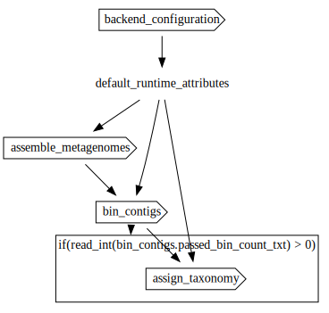

<h1 align="center"></h1>

<h1 align="center">PacBio Metagenomics Pipeline</h1>

Workflow for identifying high-quality MAGs (Metagenome-Assembled Genomes) from PacBio HiFi metagenomic assemblies written in [Workflow Description Language (WDL)](https://openwdl.org/).

- For the snakemake version of these workflows, see [here](https://github.com/PacificBiosciences/pb-metagenomics-tools).
- Docker images used by these workflows are defined [here](https://github.com/PacificBiosciences/wdl-dockerfiles).
- Common tasks that may be reused within or between workflows are defined [here](https://github.com/PacificBiosciences/wdl-common).

# Workflow

**Workflow entrypoint**: [workflows/main.wdl](workflows/main.wdl)

The metagenomics workflow combines contig assembly and PacBio's [HiFi-MAG-Pipeline](https://github.com/PacificBiosciences/pb-metagenomics-tools/tree/master/HiFi-MAG-Pipeline). This includes a completeness-aware binning step to identify complete contigs (>500kb and >93% complete) and incomplete contigs (<500kb and/or <93% complete). Completeness is assessed using [CheckM2](https://github.com/chklovski/CheckM2)). Coverage is calculated for binning steps. The long contigs that are <93% complete are pooled with incomplete contigs and this set goes through binning with [MetaBAT2](https://bitbucket.org/berkeleylab/metabat) and [SemiBin2](https://github.com/BigDataBiology/SemiBin). The two bin sets are compared and merged using [DAS Tool](https://github.com/cmks/DAS_Tool). The complete contigs and merged bin set are pooled together to assess bin quality. All bins/MAGs that passed filtering undergo taxonomic assignment and data summaries are produced.



## Setup

Clone a tagged version of the git repository.  Use the `--branch` flag to pull the desired version, and the `--recursive` flag to pull code from any submodules.
 
```
git clone \
  --depth 1 --branch v1.0.0 \  # for reproducibility
  --recursive \                # to clone submodule
  https://github.com/PacificBiosciences/HiFi-MAG-WDL.git
```

## Resource requirements

The workflow requires at minimum 48 cores, 45-150 GB of RAM, and >250GB temporary disk space. Ensure that the backend environment you're using has enough quota to run the workflow.

## Reference datasets and associated workflow files

Reference datasets are hosted publicly for use in the pipeline. For data locations, see the [backend-specific documentation](backends/) and template inputs files for each backend with paths to publicly hosted reference files filled out.

# Running the workflow

1. [Select a backend environment](#selecting-a-backend)
2. [Configure a workflow execution engine in the chosen environment](#configuring-a-workflow-engine)
3. [Fill out the inputs JSON file for your cohort](#filling-out-the-inputs-json)
4. [Run the workflow](#running-the-workflow-1)

## Selecting a backend

The workflow can be run on Azure, AWS, GCP, or HPC. Your choice of backend will largely be determined by the location of your data.

For backend-specific configuration, see the relevant documentation:

- [Azure](backends/azure)
- [AWS](backends/aws)
- [GCP](backends/gcp)
- [HPC](backends/hpc)

## Configuring a workflow engine and container runtime

An execution engine is required to run workflows. Two popular engines for running WDL-based workflows are [`miniwdl`](https://miniwdl.readthedocs.io/en/latest/getting_started.html) and [`Cromwell`](https://cromwell.readthedocs.io/en/stable/tutorials/FiveMinuteIntro/).

Because workflow dependencies are containerized, a container runtime is required. This workflow has been tested with [Docker](https://docs.docker.com/get-docker/) and [Singularity](https://docs.sylabs.io/guides/3.10/user-guide/) container runtimes.

| Engine | Azure | AWS | GCP | HPC |
| :- | :- | :- | :- | :- |
| [**miniwdl**](https://github.com/chanzuckerberg/miniwdl#scaling-up) | _Unsupported_ | Supported via the [Amazon Genomics CLI](https://aws.amazon.com/genomics-cli/) | _Unsupported_ | (SLURM only) Supported via the [`miniwdl-slurm`](https://github.com/miniwdl-ext/miniwdl-slurm) plugin |
| [**Cromwell**](https://cromwell.readthedocs.io/en/stable/backends/Backends/) | Supported via [Cromwell on Azure](https://github.com/microsoft/CromwellOnAzure) | Supported via the [Amazon Genomics CLI](https://aws.amazon.com/genomics-cli/) | Supported via Google's [Pipelines API](https://cromwell.readthedocs.io/en/stable/backends/Google/) | Supported - [Configuration varies depending on HPC infrastructure](https://cromwell.readthedocs.io/en/stable/tutorials/HPCIntro/) |

## Filling out the inputs JSON

The input to a workflow run is defined in JSON format. Template input files with reference dataset information filled out are available for each backend:

- [Azure](backends/azure/inputs.azure.json)
- [AWS](backends/aws/inputs.aws.json)
- [GCP](backends/gcp/inputs.gcp.json)
- [HPC](backends/hpc/inputs.hpc.json)

Using the appropriate inputs template file, fill in the cohort and sample information (see [Workflow Inputs](#workflow-inputs) for more information on the input structure).

If using an HPC backend, you will need to download the reference bundle and replace the `<local_path_prefix>` in the input template file with the local path to the reference datasets on your HPC.

## Running the workflow

Run the workflow using the engine and backend that you have configured ([miniwdl](#run-directly-using-miniwdl), [Cromwell](#run-directly-using-cromwell).

Note that the calls to `miniwdl` and `Cromwell` assume you are accessing the engine directly on the machine on which it has been deployed. Depending on the backend you have configured, you may be able to submit workflows using different methods (e.g. using trigger files in Azure, or using the Amazon Genomics CLI in AWS).

### Run directly using miniwdl

`miniwdl run workflows/main.wdl -i <input_file_path.json>`

### Run directly using Cromwell

`java -jar <cromwell_jar_path> run workflows/main.wdl -i <input_file_path.json>`

If Cromwell is running in server mode, the workflow can be submitted using cURL. Fill in the values of CROMWELL_URL and INPUTS_JSON below, then from the root of the repository, run:

```bash
# The base URL (and port, if applicable) of your Cromwell server
CROMWELL_URL=
# The path to your inputs JSON file
INPUTS_JSON=

(cd workflows && zip -r dependencies.zip assemble_metagenomes/ assign_taxonomy/ bin_contigs/ wdl-common/)
curl -X "POST" \
  "${CROMWELL_URL}/api/workflows/v1" \
  -H "accept: application/json" \
  -H "Content-Type: multipart/form-data" \
  -F "workflowSource=@workflows/main.wdl" \
  -F "workflowInputs=@${INPUTS_JSON};type=application/json" \
  -F "workflowDependencies=@workflows/dependencies.zip;type=application/zip"
```

To specify [workflow options](https://cromwell.readthedocs.io/en/latest/wf_options/Overview/), add the following to the request (assuming your options file is a file called `options.json` located in the `pwd`): `-F "workflowOptions=@options.json;type=application/json"`.

# Workflow inputs

This section describes the inputs required for a run of the workflow. An input template file may be found [here](workflows/input_template.json).

# General inputs

| Type | Name | Description | Notes |
| :- | :- | :- | :- |
| String | sample_id | Sample ID; used for naming files. | |
| File | hifi_reads_bam | HiFi reads in BAM format. If supplied, the reads will first be converted to a FASTQ. One of [hifi_reads_bam, hifi_reads_fastq] is required. | |
| File | hifi_reads_fastq | HiFi reads in FASTQ format. One of [hifi_reads_bam, hifi_reads_fastq] is required. | |
| File | checkm2_ref_db | The CheckM2 DIAMOND reference database Uniref100/KO used to predict the completeness and contamination of MAGs. | |
| Int | min_contig_length | Minimum size of a contig to consider a long contig. [500000] | |
| Int | min_contig_completeness | Minimum completeness percentage (from CheckM2) to mark a contig as complete and place it in a distinct bin; this value should not be lower than 90%. [93] | |
| Int | metabat2_min_contig_size | The minimum size of contig to be included in binning for MetaBAT2. [30000] | |
| String | semibin2_model | The trained model to be used in SemiBin2. If set to 'TRAIN', a new model will be trained from your data. ('TRAIN', 'human_gut', 'human_oral', 'dog_gut', 'cat_gut', 'mouse_gut', 'pig_gut', 'chicken_caecum', 'ocean', 'soil', 'built_environment', 'wastewater',  'global') ['global'] | |
| String | dastool_search_engine | The engine for single copy gene searching used in DAS Tool. ('blast', 'diamond', 'usearch') ['diamond'] | |
| Float | dastool_score_threshold | Score threshold until selection algorithm will keep selecting bins (0..1); used by DAS Tool. [0.2] | |
| Int | min_mag_completeness | Minimum completeness percent for a genome bin. [70] | |
| Int | max_mag_contamination | Maximum contamination threshold for a genome bin. [10] | |
| Int | max_contigs | The maximum number of contigs allowed in a genome bin. [20] | |
| File | gtdbtk_data_tar_gz | A .tar.gz file of GTDB-Tk (Genome Database Taxonomy toolkit) reference data, release207_v2 used for assigning taxonomic classifications to bacterial and archaeal genomes. | |

## Other inputs

| Type | Name | Description | Notes |
| :- | :- | :- | :- |
| String | backend | Backend where the workflow will be executed. | \["Azure", "AWS", "GCP", "HPC"\] |
| String? | zones | Zones where compute will take place; required if backend is set to 'AWS' or 'GCP'. | <ul><li>[Determining available zones in AWS](backends/aws/README.md#determining-available-zones)</li><li>[Determining available zones in GCP](backends/gcp/README.md#determining-available-zones)</li></ul> |
| String? | aws_spot_queue_arn | Queue ARN for the spot batch queue; required if backend is set to 'AWS' and `preemptible` is set to `true`. | [Determining the AWS queue ARN](backends/aws/README.md#determining-the-aws-batch-queue-arn) |
| String? | aws_on_demand_queue_arn | Queue ARN for the on demand batch queue; required if backend is set to 'AWS' and `preemptible` is set to `false`. | [Determining the AWS queue ARN](backends/aws/README.md#determining-the-aws-batch-queue-arn) |
| String? | container_registry | Container registry where workflow images are hosted. If left blank, [PacBio's public Quay.io registry](https://quay.io/organization/pacbio) will be used. | |
| Boolean | preemptible | If set to `true`, run tasks preemptibly where possible. On-demand VMs will be used only for tasks that run for >24 hours if the backend is set to GCP. If set to `false`, on-demand VMs will be used for every task. Ignored if backend is set to HPC. | \[true, false\] |

# Workflow outputs

## Assemble metagenomes

| Type | Name | Description | Notes |
| :- | :- | :- | :- |
| File? | converted_fastq | If a BAM file was provided, the converted FASTQ version of that file. | |
| File | assembled_contigs_gfa | Assembled contigs in gfa format. | |
| File | assembled_contigs_fa_gz | Assembled contigs in gzipped-fasta format. | |

## Bin contigs

| Type | Name | Description | Notes |
| :- | :- | :- | :- |
| Array[File] | dereplicated_bin_fas | Set of passing long contig and non-redundant incomplete contig bins. | |
| File | bin_quality_report_tsv | CheckM2 completeness/contamination report for long and non-redundant incomplete contig bins. | |
| File | gtdb_batch_txt | GTDB-Tk batch file; used during taxonomy assignment. | |
| File | passed_bin_count_txt | Txt file containing an integer specifying the number of bins that passed quality control. | |
| File | filtered_quality_report_tsv | Filtered `bin_quality_report_tsv` containing quality information about passing bins. | |

### Bin long contigs

| Type | Name | Description | Notes |
| :- | :- | :- | :- |
| File | long_contig_bin_map | Map between passing long contigs and bins in TSV format. | |
| File? | long_contig_bin_quality_report_tsv | CheckM2 completeness/conamination report for long contigs. | |
| File? | filtered_long_contig_bin_map | Map between passing long contigs and bins that also pass the completeness threshold in TSV format. | |
| File? | long_contig_scatterplot_pdf | Completeness vs. size scatterplot. | |
| File? | long_contig_histogram_pdf | Completeness histogram. | |
| File | passing_long_contig_bin_map | If any contigs pass the length filter, this will be the `filtered_long_contig_bin_map`; otherwise, this is the `long_contig_bin_map`. | |
| Array[File] | filtered_long_bin_fas | Set of long bin fastas that pass the length and completeness thresholds. | |
| File | incomplete_contigs_fa | Fasta file containing contigs that do not pass either length or completeness thresholds. | |

### Bin incomplete contigs

| Type | Name | Description | Notes |
| :- | :- | :- | :- |
| IndexData | aligned_sorted_bam | HiFi reads aligned to the assembled contigs. | |
| File | contig_depth_txt | Summary of aligned BAM contig depths. | |
| Array[File] | metabat2_bin_fas | Bins output by `metabat2` in fasta format. | |
| File | metabat2_contig_bin_map | Map between contigs and `metabat2` bins. | |
| File | semibin2_bins_tsv | Bin info TSV output by `semibin2`. | |
| Array[File] | semibin2_bin_fas | Bins output by `semibin2` in fasta format. | |
| File | semibin2_contig_bin_map | Map between contigs and `semibin2` bins. | |
| Array[File] | merged_incomplete_bin_fas | Non-redundant incomplete contig bin set from `metabat2` and `semibin2`. | |

## Assign taxonomy

These outputs will be generated if at least one contig passes filters.

| Type | Name | Description | Notes |
| :- | :- | :- | :- |
| File? | gtdbtk_summary_txt | GTDB-Tk summary file in txt format. | |
| File? | gtdbk_output_tar_gz | GTDB-Tk results for dereplicated bins that passed filtering with CheckM2. | |
| File? | mag_summary_txt | A main summary file that brings together information from CheckM2 and GTDB-Tk for all MAGs that pass the filtering step. | |
| Array[File]? | filtered_mags_fas | The fasta files for all high-quality MAGs/bins. | |
| File? | dastool_bins_plot_pdf |  Figure that shows the dereplicated bins that were created from the set of incomplete contigs (using MetaBat2 and SemiBin2) as well as the long complete contigs. | |
| File? | contigs_quality_plot_pdf | A plot showing the relationship between completeness and contamination for each high-quality MAG recovered, colored by the number of contigs per MAG. | |
| File? | genome_size_depths_plot_df | A plot showing the relationship between genome size and depth of coverage for each high-quality MAG recovered, colored by % GC content per MAG. | |

# Tool versions and Docker images

Docker images definitions used by this workflow can be found in [the wdl-dockerfiles repository](https://github.com/PacificBiosciences/wdl-dockerfiles/tree/987efde4d614a292fbfe9f3cf146b63005ad6a8a). Images are hosted in PacBio's [quay.io](https://quay.io/organization/pacbio). Docker images used in the workflow are pegged to specific versions by referring to their digests rather than tags.

The Docker image used by a particular step of the workflow can be identified by looking at the `docker` key in the `runtime` block for the given task. Images can be referenced in the following table by looking for the name after the final `/` character and before the `@sha256:...`. For example, the image referred to here is "align_hifiasm":
> ~{runtime_attributes.container_registry}/**align_hifiasm**@sha256:3968cb<...>b01f80fe

| Image | Major tool versions | Links |
| :- | :- | :- |
| python | <ul><li>python 3.7; custom scripts</li></ul> | [Dockerfile](https://github.com/PacificBiosciences/wdl-dockerfiles/tree/343bb7f1ce6954c49e2ca1ca029f2878015a7940/docker/python/metagenomics) |
| samtools | <ul><li>[samtools 1.10](https://github.com/samtools/samtools/releases/tag/1.10)</li><li>[minimap2 2.17](https://github.com/lh3/minimap2/releases/tag/v2.17)</li></ul> | [Dockerfile](https://github.com/PacificBiosciences/wdl-dockerfiles/tree/343bb7f1ce6954c49e2ca1ca029f2878015a7940/docker/samtools/metagenomics) |
| hifiasm-meta | <ul><li>[hifiasm-meta 0.3.1](https://github.com/xfengnefx/hifiasm-meta/releases/tag/hamtv0.3.1)</li><li>[gfatools 0.4](https://github.com/lh3/gfatools/releases/tag/v0.4)</li></ul> | [Dockerfile](https://github.com/PacificBiosciences/wdl-dockerfiles/tree/343bb7f1ce6954c49e2ca1ca029f2878015a7940/docker/hifiasm-meta) |
| checkm2 | <ul><li>[checkm2 1.0.1](https://github.com/chklovski/CheckM2/releases/tag/1.0.1)</li></ul> | [Dockerfile](https://github.com/PacificBiosciences/wdl-dockerfiles/tree/343bb7f1ce6954c49e2ca1ca029f2878015a7940/docker/checkm2) |
| metabat | <ul><li>[metabat2 2.15](https://bitbucket.org/berkeleylab/metabat/downloads/?tab=tags)</li></ul> | [Dockerfile](https://github.com/PacificBiosciences/wdl-dockerfiles/tree/343bb7f1ce6954c49e2ca1ca029f2878015a7940/docker/metabat) |
| semibin | <ul><li>[semibin 1.5](https://github.com/BigDataBiology/SemiBin/releases/tag/v1.5.0)</li></ul> | [Dockerfile](https://github.com/PacificBiosciences/wdl-dockerfiles/tree/343bb7f1ce6954c49e2ca1ca029f2878015a7940/docker/semibin) |
| dastool | <ul><li>[dastool 1.1.6](https://github.com/cmks/DAS_Tool/releases/tag/1.1.6)</li></ul> | [Dockerfile](https://github.com/PacificBiosciences/wdl-dockerfiles/tree/343bb7f1ce6954c49e2ca1ca029f2878015a7940/docker/dastool) |
| gtdbtk | <ul><li>[gtdbtk 2.1.1](https://github.com/Ecogenomics/GTDBTk/releases/tag/2.1.1)</li><li>python 3.7; custom scripts</li></ul> | [Dockerfile](https://github.com/PacificBiosciences/wdl-dockerfiles/tree/343bb7f1ce6954c49e2ca1ca029f2878015a7940/docker/gtdbtk) |

---

## DISCLAIMER

TO THE GREATEST EXTENT PERMITTED BY APPLICABLE LAW, THIS WEBSITE AND ITS CONTENT, INCLUDING ALL SOFTWARE, SOFTWARE CODE, SITE-RELATED SERVICES, AND DATA, ARE PROVIDED "AS IS," WITH ALL FAULTS, WITH NO REPRESENTATIONS OR WARRANTIES OF ANY KIND, EITHER EXPRESS OR IMPLIED, INCLUDING, BUT NOT LIMITED TO, ANY WARRANTIES OF MERCHANTABILITY, SATISFACTORY QUALITY, NON-INFRINGEMENT OR FITNESS FOR A PARTICULAR PURPOSE. ALL WARRANTIES ARE REJECTED AND DISCLAIMED. YOU ASSUME TOTAL RESPONSIBILITY AND RISK FOR YOUR USE OF THE FOREGOING. PACBIO IS NOT OBLIGATED TO PROVIDE ANY SUPPORT FOR ANY OF THE FOREGOING, AND ANY SUPPORT PACBIO DOES PROVIDE IS SIMILARLY PROVIDED WITHOUT REPRESENTATION OR WARRANTY OF ANY KIND. NO ORAL OR WRITTEN INFORMATION OR ADVICE SHALL CREATE A REPRESENTATION OR WARRANTY OF ANY KIND. ANY REFERENCES TO SPECIFIC PRODUCTS OR SERVICES ON THE WEBSITES DO NOT CONSTITUTE OR IMPLY A RECOMMENDATION OR ENDORSEMENT BY PACBIO.